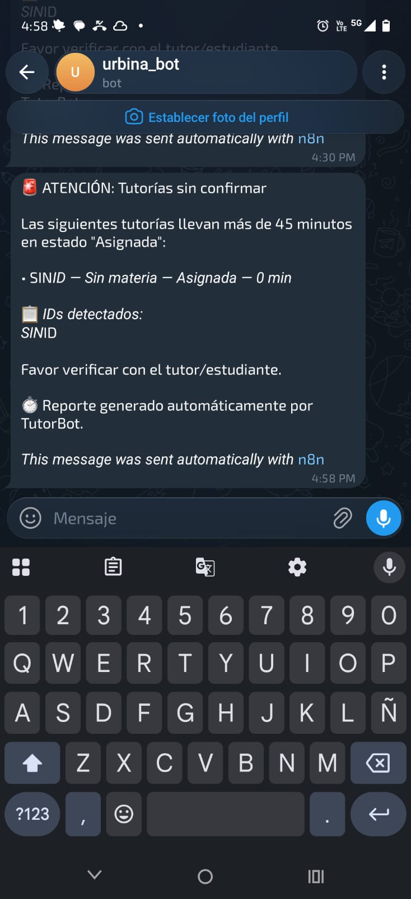

# TutorBot — Escalamiento de Tutorías sin Confirmar

## Examen 1 — Update

## 📌 Descripción

Se implementó un workflow automatizado en **n8n** que detecta tutorías que permanecen en estado `Asignada` durante más de **45 minutos** sin confirmación, y escala el caso a coordinación mediante **Telegram**.

## ⚙️ Lógica implementada

1. Un **Schedule Trigger** ejecuta el workflow cada 30 minutos.
2. Se consultan las tutorías almacenadas en **Google Sheets**.
3. Se filtran únicamente las tutorías cuyo estado sea `Asignada`.
4. Se calcula el tiempo transcurrido desde la creación de la tutoría.
5. Si han transcurrido más de 45 minutos, la tutoría se considera **retrasada**.
6. Se genera un reporte con los IDs de las tutorías detectadas.
7. El reporte se envía automáticamente a coordinación mediante **Telegram**.

## 🔄 Flujo

```
Schedule Trigger → Google Sheets → Filtrar tutorías retrasadas → IF → Construir reporte → Telegram
```

## 💬 Mensaje de alerta

```
🚨 ATENCIÓN: Tutorías sin confirmar

Las siguientes tutorías llevan más de 45 min sin confirmar.

Favor verificar con el tutor/estudiante.
```

## 📸 Captura de alerta en Telegram



## ✅ Resultado

El sistema permite detectar automáticamente tutorías que pueden quedar olvidadas en estado `Asignada` y escalar el caso a coordinación sin intervención manual.

## ⚠️ Nota

En la captura de ejemplo, la tutoría reportada aparece con `SIN ID`, `Sin materia` y `0 min`. Esto sugiere que el registro de origen en Google Sheets tenía campos vacíos (id_tutoria, materia y/o fecha) al momento de la ejecución. Vale la pena validar que esas columnas no queden vacías al crear una tutoría, para que el reporte de escalamiento muestre siempre datos completos.
